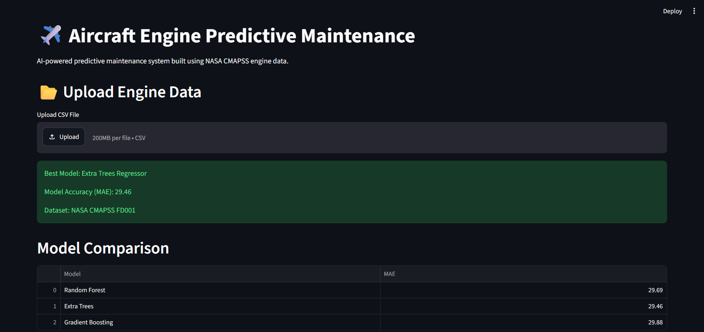
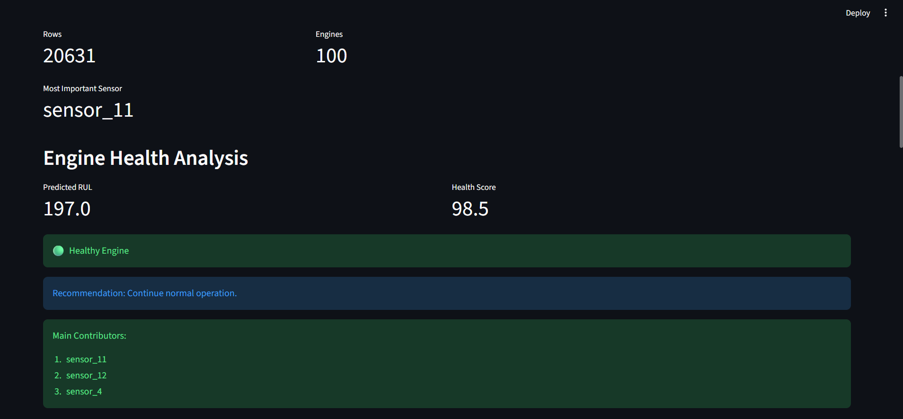
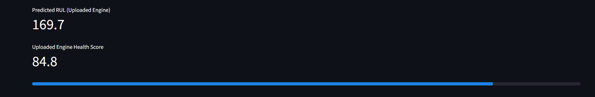
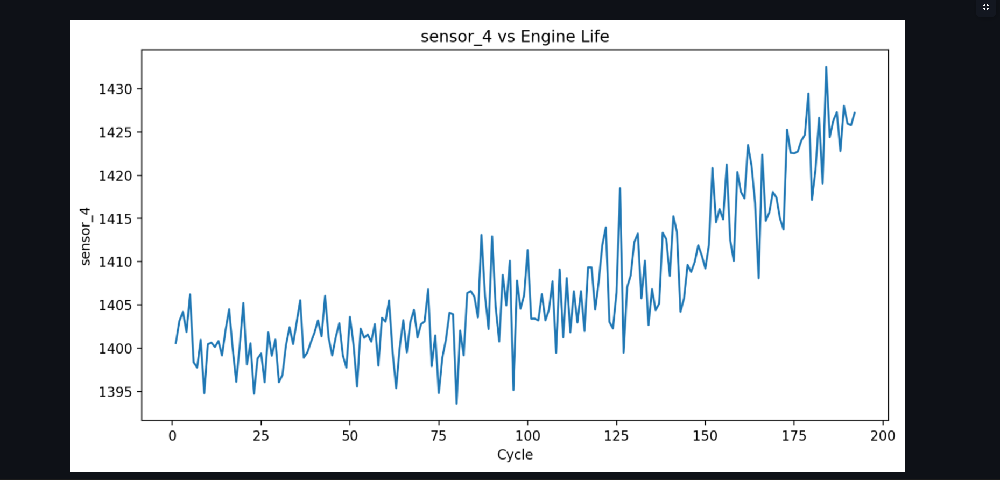

# ✈️ Aircraft Engine Predictive Maintenance

AI-powered predictive maintenance system that estimates the Remaining Useful Life (RUL) of aircraft engines using NASA CMAPSS sensor data, machine learning, and an interactive Streamlit dashboard.

---

## 🚀 Features

- Remaining Useful Life (RUL) Prediction
- Engine Health Score Calculation
- Maintenance Recommendations
- Sensor Importance Analysis
- Feature Importance Visualization
- Sensor Trend Analysis
- CSV Upload and Prediction
- Interactive Streamlit Dashboard

---

## 🛠️ Technologies Used

- Python
- Pandas
- NumPy
- Scikit-Learn
- Matplotlib
- Streamlit
- Joblib

---

## 📊 Machine Learning Models Compared

| Model | MAE |
|---------|---------|
| Random Forest | 29.69 |
| Extra Trees | 29.46 |
| Gradient Boosting | 29.88 |

### Best Model

**Extra Trees Regressor**

MAE: **29.46**

---

## 📁 Dataset

NASA CMAPSS Turbofan Engine Degradation Simulation Dataset

---

## 📈 Dashboard Features

- Engine health monitoring
- RUL prediction
- Health score estimation
- Maintenance recommendation system
- Sensor importance ranking
- Sensor trend visualization
- Upload custom engine data for prediction

---

## ▶️ Run Locally

```bash
pip install -r requirements.txt
streamlit run app.py
```

---
## 📸 Project Screenshots

### Dashboard Overview



---

### Engine Health Analysis



---

### Uploaded Engine Prediction



---

### Sensor Trend Analysis



---
## 👨‍💻 Author

Built by Aishwarya Manoj Nair as an end-to-end Machine Learning and Streamlit project.
